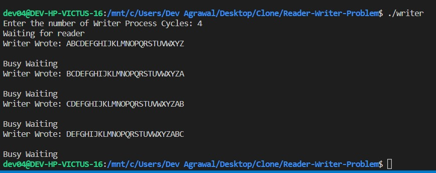
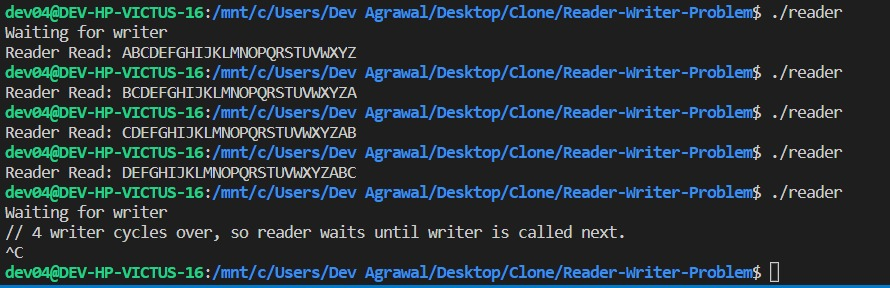

# Reader Writer Problem

## Problem Statement
Your task is to write two programs, reader.c and writer.c which will have a block of shared memory. The writer must continuously write some data to the shared memory or buffer. Once the buffer is filled, the writer should overwrite existing data. The reader should read this data and print it out.

Now implement synchronization between the two processes such that the reader can print out all the data written by the writer correctly (Reader must print it before the writer overwrites the data). The implementation is up to you. You can write a control program or use an algorithm(See Dekker's algorithm) or any other working method. Do not use builtin functions in c to create & use Mutexes or Semaphores like sem_init(), pthread_mutex_t etc.

As a bonus task, make this system work for multiple readers and writers i.e only one writer must be allowed to write at a time, multiple readers can be allowed to read the buffer if there is no writer writing to it.


---
## Requirements
- GNU Compiler Collection (GCC)
- OpenMP 

For an installation guide, kindly refer the [References](#references)

---
## Solving the Critical Section Problem

## 1. Mutual Exclusion
   -If process Pi is executing in its critical section, 
then no other processes can be executing in their critical sections

   Reader Mutex Check
   ```c
   while((char)(*s)!='1')
		{
			//waiting for lock to be free
		}
   ``` 
   Writer Mutex Check
   ```c
   while((char)(*s) == '1')
			{
				//waiting for reader to finish
			}
   ```
   
  ### Hence, Mutual Exclusion is achieved by the use of a mutex lock.

  ####     (char)(*s) points to the first character of the shared memory. We have reserved the first char of the shared memory, and have used it as a mutex lock / flag. This helps achieve mutual exlusion and enforce which process can access the shared memory.


## 2.  Progress
 - If no process is executing in its critical section and there exist some processes that wish to enter their critical section, then the selection of the process that will enter the critical section next cannot be postponed indefinitely

Reader Mutex Check
>   while((char)(*s)!='1')

Writer sets the flag to 1 upon completion, indicating that shared memory can now be accesssed by a reader process.

   Writer Mutex Check
>   while((char)(*s) == '1')

This check essentially ensures that if it's reader's turn, wait. Otherwise, the writer process may enter and thereby protects the mechanism in case there is any garbage value in (char)(*s). 

### Thus Progress is ensured.

## 3. Bounded Waiting
- A bound must exist on the number of times that 
other processes are allowed to enter their critical sections after a process has made a request to enter its critical section and before that request is granted

After the completion of reader/writer process it changes the flag / mutex value so that the other process can go, and this denies the consequent reentry of the same process. 

[writer.c](./writer.c) Line 59
> *shm='1'; //set turn to reader

[reader.c](./reader.c) Line 43
> *shm='0';  //set turn to writer

This ensures bounded waiting as no process can re-enter immediately after having accessed the shared memory. But in the current implementation, it is applicable only for a pair of reader writer processes at a time.

### Thus, Bounded Waiting is ensured.
---
### Since, Mutual Exclusion; Progress and Bounded Waiting Requirements have been met, we can say that this solution is Critical Section Safe.
---
## Terminal Output Screenshots 
### Writer Output

1. Asks for number of writer cycles 
2. Writing checks for reader
3. Writer writes, then proceeds to busy wait for reader to read
4. Repeats

### Reader Output

1. Waits for Reader
2. Prints what was written into the buffer
3. Exits, and the new reader process is invoked
4. Repeats
5. After 4 reader and writer cycles are over, the turn is set to writer. If reader is called again, it'll wait until the writer process writes something in the shared memory and sets the flag to reader.

---
## <ins> Approach for Synchronizing Multiple Readers and Writers </ins>

### 1. Multiple Readers - Single Writer

For this solution, 2 mutexes/flags would be needed.
 _r_mutex_  and _rw_mutex_ 

### i) Reader First Problem
- No writer is allowed to access the critical section as long as there's a reader in the system. This can lead to starvation of the writer process. 
- The implementation for that would be as follows:
```c
//Structure of Writer Process
while (true) {
 wait(rw_mutex); 
 ...
 /* writing is performed */ 
 ... 
 signal(rw_mutex); 
 }

//The structure of a Reader process
 while (true){
 wait(r_mutex);
 read_count++;
 if (read_count == 1) /* first reader */ 
 {
    wait(rw_mutex); // if first reader, acquire writer lock
 } 
 signal(r_mutex); 
 ...
 /* reading is performed */ 
 ... 
 wait(r_mutex);
 read count--;
 if (read_count == 0) /* last reader */
 signal(rw_mutex); 
 signal(r_mutex); 
 } 
```

### ii) Second Reader Writer Problem

In this implementation, once a writer is ready to write, no “newly arrived reader” is allowed to read. This too can lead to starvation.

- Problem is solved on some systems by kernel providing reader-writer locks


## 2. Multiple Readers - Multiple Writers
Since, the use of library created mutexes and semaphores is prohitibited; Peterson's Solution Implementation with Memory Barriers might be helpful.

---
## Additional Hardware Information

### Kernel Version
Kernel version can be found using the following command in linux based terminals:
> uname -r 

> 5.10.16.3-microsoft-standard-WSL2

### Processor Details
- Name: [AMD Ryzen™ 7 5800H](https://www.amd.com/en/products/apu/amd-ryzen-7-5800h "Official Specs by AMD")
- Number of CPU Cores: 8
- Number of Threads: 16
- Base Clock: 3.2GHz
- Max Boost Clock: Upto 4.4 Ghz
- L2 Cache: 4 MB
- L3 Cache: 16 MB   
- Default TDP: 45W

---
## References
1. [Open MP Documentation](https://github.com/ResearchComputing/Documentation/blob/main/docs/programming/OpenMP-C.md "GitHub")
2. [OpenMP and GCC Installation Guide](https://www.geeksforgeeks.org/openmp-introduction-with-installation-guide/ "GeeksForGeeks")
3. [Time command in Linux with examples](https://www.geeksforgeeks.org/time-command-in-linux-with-examples/#:~:text=time%20command%20in%20Linux%20is,a%20command%20when%20it%20terminates. "GeeksForGeeks")
4. [Documentation for rand_r()](https://linux.die.net/man/3/rand_r "linux.die.net")
5. [Documentation for calloc()](https://pubs.opengroup.org/onlinepubs/009696799/functions/calloc.html "pubs.opengroup.org")
6. Operating Systems Lecture Slides by Dr. Mohit P Tahiliani
7. Operating Systems Concepts 10th Ed by Abraham Silberschatz, Peter Baer Galvin and Greg Gagne
8. Shared Memory Lecture Slides by Dept. of Information Technology, NITK

---
## Author
[@DevAgrawal04](https://github.com/DevAgrawal04 "GitHub")

- [LinkedIn](https://www.linkedin.com/in/dev-agrawal-04/ "dev-agrawal-04")
  
For any queries or feedback, please feel free to reach out.
